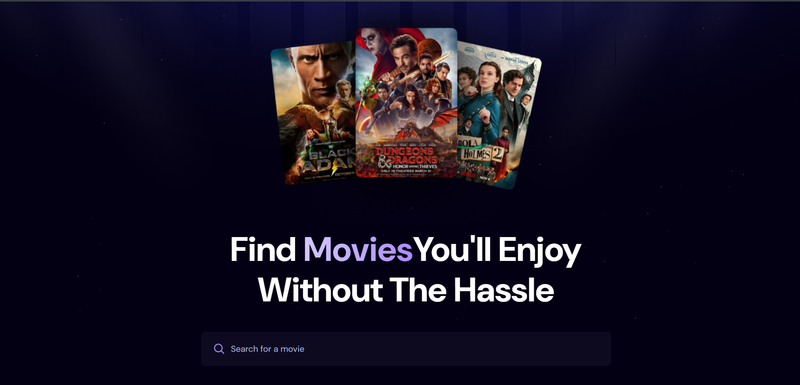
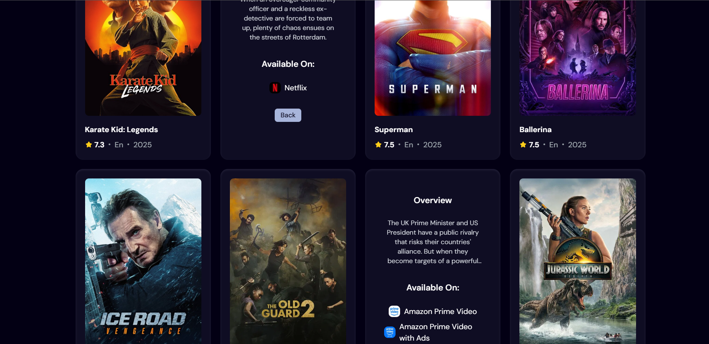
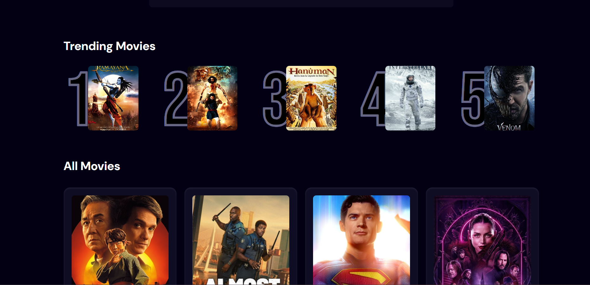

# 🎬 Movie Explorer App

A sleek and responsive movie browsing web app built using React and Tailwind CSS. It allows users to explore trending movies, search for any title, and view detailed information. Powered by the TMDB API and Appwrite for cloud database integration.

---

## 🚀 Live Demo

🔗 **Coming soon...**  
(_Will be deployed on Vercel or Netlify_)

---

## 🧩 Features

-   🔍 Real-time movie **search** with debounce
-   📊 Displays **trending movies** using TMDB API
-   🃏 **Flip card animation** to reveal:
    -   Movie synopsis
    -   Streaming platform logos
    -   Watch links (optional)
-   🧪 Loading spinner while fetching API data
-   📱 Fully responsive layout
-   🌙 Clean and modern UI with Tailwind CSS

---

## 🛠️ Tech Stack

| Area            | Technologies Used                  |
| --------------- | ---------------------------------- |
| Frontend        | React 19, JSX, Hooks, Tailwind CSS |
| Build Tool      | Vite                               |
| State & Hooks   | React Hooks, `react-use`           |
| API Integration | TMDB API                           |
| Cloud Backend   | Appwrite (Database only)           |
| Code Quality    | ESLint with React plugin           |
| Deployment      | Vercel (planned)                   |

---

## ☁️ Backend Integration with Appwrite

This project uses **Appwrite’s cloud database** to manage dynamic movie-related data.

-   📁 Cloud collection for storing/fetching content
-   📤 Integrated Appwrite SDK with React for API calls
-   📦 BaaS (Backend-as-a-Service) usage without writing custom backend
-   🔐 NoAuth/Auth-Free DB access (based on project settings)

---

## 📂 Folder Structure

```
movie-app/
├── public/
│   ├── icons/         # Streaming platform logos
│   └── screenshot.png # (Add if you want)
├── src/
│   ├── components/    # MovieCard, SearchBar, etc.
│   ├── pages/         # Home page layout
│   ├── App.jsx
│   └── index.css
├── .env
├── package.json
└── vite.config.js
```

---

## 📦 How to Run Locally

```bash
git clone https://github.com/HarshlyHk/movie-app.git
cd movie-app
npm install
touch .env  # Add your TMDB API key
npm run dev
```

---

## 🔐 Environment Variables

Create a `.env` file in the root folder and add your API key:

```env
VITE_TMDB_API_KEY=your_tmdb_api_key
```

You can get your key from: [https://www.themoviedb.org/settings/api](https://www.themoviedb.org/settings/api)

---

## 🧠 Skills Demonstrated

-   > ⚛️ React 19 with modern Hooks (including `react-use`)
-   > 🎨 Tailwind CSS for fast UI styling
-   > ⚙️ Vite for lightning-fast builds and hot reloads
-   > 📡 API integration using TMDB (Axios/fetch)
-   > ☁️ Appwrite Database (BaaS) for cloud-stored movie data
-   > 🧼 ESLint setup for code quality and best practices
-   > 🛠️ Git & GitHub for version control and collaboration

---

## 📸 Screenshots

### 🏠 Home Screen



### 🎬 Movie Info (Back Side Flip)



### 🔍 Search & Result State



---

## 🙋‍♂️ Author

-   **Harsh Kumar**  
    React & AI/ML Enthusiast | Full-stack Learner  
    [GitHub Profile](https://github.com/HarshlyHk)
    📧 Email: harsh4212002@gmail.com

---

## 📄 License

This project is open-source under the [MIT License](LICENSE).
